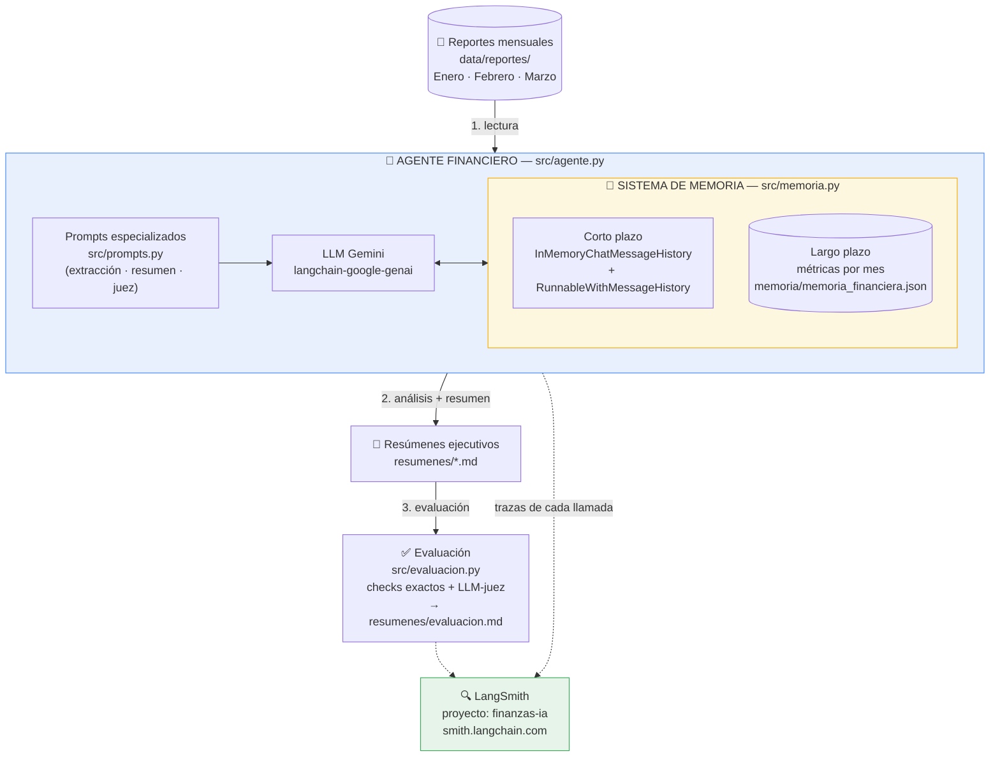
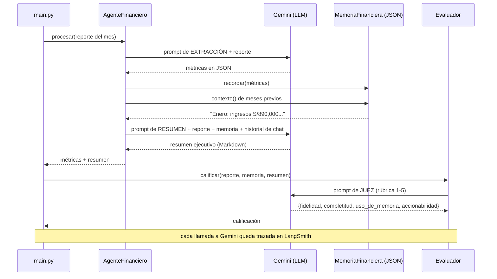

# Arquitectura — Agente IA Financiero con Memoria

**Empresa:** Finanzas Inteligentes SAC
**Objetivo:** Analizar reportes financieros mensuales de sucursales y generar resúmenes ejecutivos automáticamente, recordando el contexto de meses anteriores.

## Diagrama general (Mermaid)



### Flujo por reporte (secuencia)



## Diagrama general (ASCII)

```
┌──────────────────┐
│  Reportes (.txt) │  data/reportes/  (Enero, Febrero, Marzo)
└────────┬─────────┘
         │ 1. lectura
         ▼
┌─────────────────────────────────────────────────────┐
│                 AGENTE FINANCIERO                   │
│                  (src/agente.py)                    │
│                                                     │
│  ┌───────────────┐      ┌─────────────────────┐    │
│  │ Prompts espe- │      │  LLM: Gemini        │    │
│  │ cializados    │─────▶│  (langchain-google- │    │
│  │ (src/prompts) │      │   genai)            │    │
│  └───────────────┘      └─────────┬───────────┘    │
│                                   │                 │
│  ┌────────────────────────────────▼──────────────┐ │
│  │              SISTEMA DE MEMORIA               │ │
│  │              (src/memoria.py)                 │ │
│  │                                               │ │
│  │  • Corto plazo: historial de conversación    │ │
│  │    (InMemoryChatMessageHistory +             │ │
│  │     RunnableWithMessageHistory)              │ │
│  │  • Largo plazo: métricas clave por mes       │ │
│  │    persistidas en JSON                       │ │
│  │    (memoria/memoria_financiera.json)         │ │
│  └───────────────────────────────────────────────┘ │
└────────┬────────────────────────────────────────────┘
         │ 2. análisis + resumen
         ▼
┌──────────────────┐      ┌──────────────────────┐
│ Resúmenes ejecu- │      │  LangSmith           │
│ tivos (.md)      │      │  (tracing/observa-   │
│ resumenes/       │      │   bilidad de cada    │
└────────┬─────────┘      │   llamada al LLM)    │
         │ 3. evaluación  └──────────────────────┘
         ▼
┌──────────────────┐
│ Evaluación       │  src/evaluacion.py
│ (rúbrica LLM +   │  → resumenes/evaluacion.md
│  checks exactos) │
└──────────────────┘
```

## Componentes

| Componente | Archivo | Responsabilidad |
|---|---|---|
| Configuración | `src/config.py` | Carga `.env` (API keys, LangSmith), define modelo |
| Memoria | `src/memoria.py` | Memoria de corto plazo (historial de chat) y largo plazo (JSON persistente con métricas por mes) |
| Prompts | `src/prompts.py` | Prompts especializados: analista financiero, extracción de métricas, resumen ejecutivo, juez evaluador |
| Agente | `src/agente.py` | Orquesta: extrae métricas → guarda en memoria → genera resumen usando contexto de meses previos |
| Evaluación | `src/evaluacion.py` | Verifica que las cifras clave aparezcan en el resumen + rúbrica con LLM-como-juez (1-5) |
| Orquestador | `main.py` | Procesa los 3 reportes en orden cronológico y ejecuta la evaluación |

## Diseño de la memoria (dos niveles)

1. **Memoria de corto plazo (conversacional):** cada llamada al LLM se envuelve con
   `RunnableWithMessageHistory`, que inyecta el historial de mensajes de la sesión.
   Así, al analizar Marzo, el agente "vio" pasar Enero y Febrero en la conversación.

2. **Memoria de largo plazo (estructurada y persistente):** después de cada análisis,
   el agente extrae métricas clave (ingresos, gastos, utilidad, mejor/peor sucursal,
   alertas) y las guarda en `memoria/memoria_financiera.json`. Al procesar el mes
   siguiente, este resumen estructurado se inyecta en el prompt, lo que permite
   comparaciones mes a mes ("los ingresos crecieron 8% respecto a febrero") incluso
   si el proceso se reinicia.

## Flujo por reporte

1. Leer `data/reportes/reporte_<mes>.txt`
2. **Extracción:** prompt de extracción → métricas en JSON → guardar en memoria de largo plazo
3. **Resumen:** prompt de resumen ejecutivo + contexto de memoria (meses previos) → resumen en Markdown
4. Guardar en `resumenes/resumen_<mes>.md`
5. Al final: `src/evaluacion.py` califica cada resumen (fidelidad de cifras + rúbrica LLM)

## Observabilidad

Con las variables `LANGSMITH_TRACING=true` y `LANGSMITH_API_KEY`, cada cadena
(extracción, resumen, evaluación) queda trazada en smith.langchain.com bajo el
proyecto `finanzas-ia`, con latencia, tokens y prompts completos.
